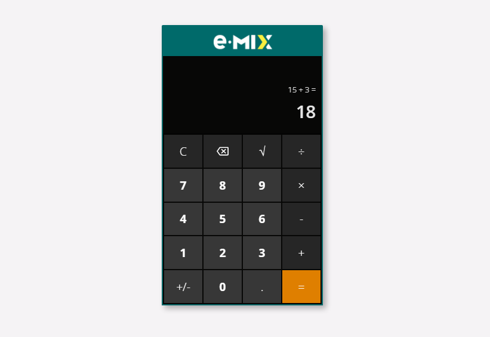

# e.Mix calculator
> Calculadora desenvolvida em um dos testes do processo seletivo da empresa [e.Mix](https://emix.com.br).
> Seu comportamento e operações são baseados na calculadora do Windows.

## Como utilizar

A calculadora está disponível [neste link](https://gustavogod.github.io/emix-calculator/), e seus botões são acionados com o click do mouse. Em breve, também será possível utilizar por meio do teclado número.

## 🛠 Tecnologias utilizadas:

- [ReactJS](https://reactjs.org)
- [Styled components](https://styled-components.com)
- [CSS](https://www.w3.org/TR/CSS/#css)
- [React Icons](https://react-icons.github.io/react-icons/)
